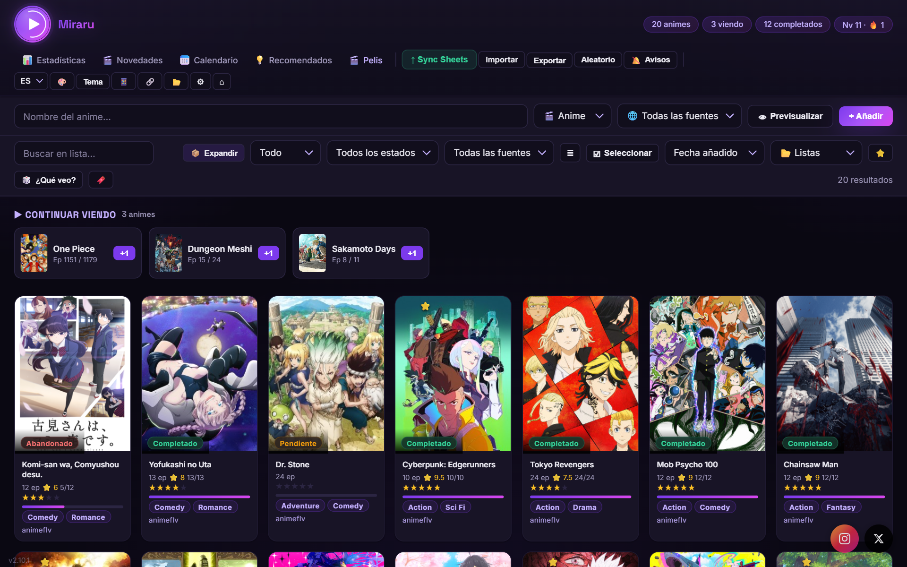
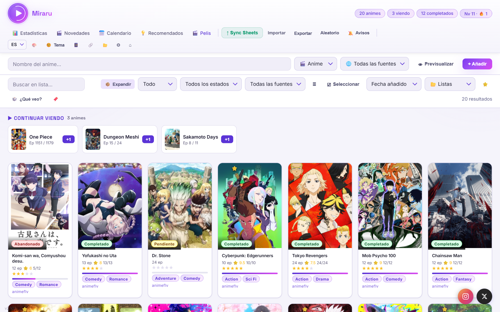
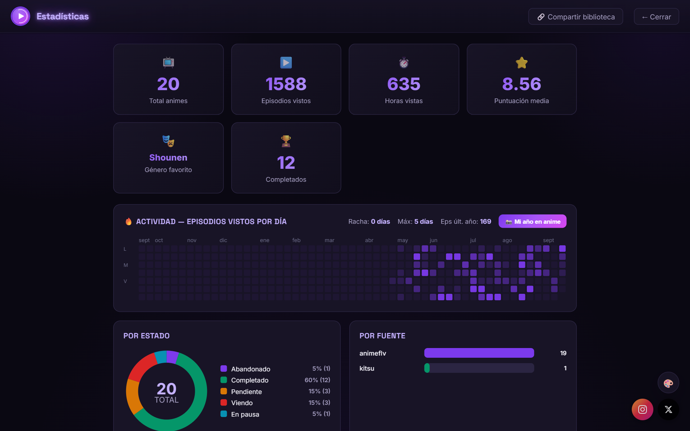

# Miraru


**Tu biblioteca personal de anime, series y películas** — app de escritorio con seguimiento de episodios, estadísticas, notificaciones, sincronización con Google Sheets y acceso móvil. Anime vía 8 fuentes; películas y series vía **TMDB**.

## 📸 Capturas

> Añade tus capturas en la carpeta `screenshots/` y se mostrarán aquí.

| Biblioteca (oscuro) | Biblioteca (claro) |
|---|---|
|  |  |

| Estadísticas | Calendario semanal |
|---|---|
|  |  |

## ✨ Características

- **8 fuentes** de búsqueda de anime: AniList, Jikan v4, Kitsu, Crunchyroll, AnimeFLV, AnimePlanet, AnimeAV1, MAL — o **todas a la vez**
- 🎬 **Sección de películas y series** (no-anime) con datos de **TMDB**: búsqueda, fichas, estados, favoritos
- Buscador con **vista previa** antes de añadir
- **Paleta de comandos** (`Ctrl+K`): salta a cualquier anime, página o acción
- Vista **grid** o **tabla compacta**
- Listas personalizadas, favoritos, temporada, puntuación, notas
- **Rating rápido** con estrellas desde la propia tarjeta (sin abrir el modal)
- **Drag & drop** entre listas
- **Atajos de teclado**: `Ctrl+K` paleta, `/` buscar, `Esc` cerrar, `N` nuevo anime
- **Operadores de búsqueda**: `genre:`, `score:`, `eps:`, `year:`, `fav:`, etc.
- Selección múltiple para acciones masivas (cambiar estado, lista, favorito, eliminar)
- En cada ficha: **tráiler**, **dónde verlo** (plataformas) y **similares** (AniList)
- Estadísticas con **donut chart**, genre pills y **tiempo hasta completar**
- **Novedades**: próximos episodios y animes en emisión (AniList API)
- **Calendario semanal** con recordatorio de los episodios que salen **hoy**
- Widget **"Continuar viendo"** en la portada y modo **maratón**
- **Recomendaciones automáticas** por géneros favoritos
- **Web Notifications** para nuevos episodios
- **Snackbar de deshacer** al eliminar (5 segundos para restaurar)
- Google Sheets sync (opcional)
- Acceso **móvil** por WiFi local (PWA instalable)
- 4 idiomas: ES / EN / FR / DE
- Modo claro y oscuro

## 📥 Instalación (usuarios) — elige la más cómoda

Ninguna necesita Python: va embebido. Todo desde la [última release](https://github.com/lucasusamentiaga/anime-tracker/releases/latest).

**A) Portátil — el menor número de pasos (recomendado)**
1. Descarga **`Miraru-Portable.exe`**.
2. Doble clic. Ya está (se abre en el navegador). Sin instalar; tus datos se guardan junto al `.exe`.

**B) Instalador (con accesos directos / desinstalable)**
1. Descarga **`Miraru-Setup.exe`** y ejecútalo.
2. Pulsa **Instalar** → **Abrir**. Crea accesos directos en escritorio y menú inicio.

**C) Gestores de paquetes (avanzado)**
Manifiestos listos en `packaging/` para publicar **una sola vez** en **Scoop** o
**winget**; después tus usuarios instalan con `scoop install miraru` o
`winget install Miraru`. Ver [`packaging/README.md`](packaging/README.md).

> Windows puede mostrar SmartScreen («editor desconocido») porque el `.exe` no
> está firmado: **Más información → Ejecutar de todas formas**. Cómo firmarlo
> para que ese aviso desaparezca: ver `packaging/README.md`.

Para desinstalar (opción B): *Configuración → Aplicaciones → Miraru → Desinstalar*.

## 🚀 Ejecutar desde el código fuente

**Doble clic en `Miraru.vbs`.** Nada más. Sin ventana de consola.

Se encarga solo de todo: busca Python (usa el `venv/` del proyecto si existe),
instala las dependencias que falten la primera vez y abre el navegador. Si
Python no está instalado, lo dice en un cuadro de diálogo con el enlace de
descarga.

Miraru **no crea accesos directos ni toca el escritorio**: todo lo suyo vive en
la carpeta del proyecto. Si quieres abrirlo de un clic, haz clic derecho sobre
`Miraru.vbs` → *Anclar a la barra de tareas* (o *Anclar a Inicio*).

**Para cerrar Miraru: botón «⏻ Salir» en el menú.** Como no hay consola que
cerrar, ese botón es lo que apaga el servidor.

> Si algo falla al arrancar, `Miraru.vbs` muestra un cuadro de diálogo con el
> error y guarda el detalle en `arranque.log` junto al propio archivo.

<details>
<summary>Arrancar a mano (desarrollo)</summary>

```bash
git clone https://github.com/lucasusamentiaga/anime-tracker.git
cd anime-tracker
pip install -r requirements.txt
python launcher.py     # experiencia completa (arranca y abre el navegador)
# o, modo headless:    python main.py   →  http://localhost:8765
```
</details>

## 📱 Móvil

1. En el PC: 📱 Móvil → introduce PIN → Activar
2. Reinicia la app
3. En el móvil: misma WiFi → `http://IP:8765/app` → Añadir a pantalla inicio (PWA)

## 🛠 Generar los ejecutables (desarrolladores)

No hace falta a mano: al **empujar un tag** (`git tag v2.7.0 && git push --tags`), GitHub
Actions compila y publica `Miraru-Setup.exe` y `Miraru-Portable.exe` en la Release
(ver `.github/workflows/release.yml`). En local:

```bash
compilar.bat                 # instalador (Miraru-Setup.exe)
python build.py --portable   # portátil (Miraru-Portable.exe)
```

## 📦 Tecnologías

- **Backend**: Python 3.9+ / FastAPI / SQLite
- **Frontend**: HTML/CSS/JS vanilla (sin frameworks)
- **APIs**: AniList GraphQL, Jikan v4 REST, Kitsu JSON:API, Crunchyroll v2
- **Empaquetado**: PyInstaller (--onedir)

## 📄 Licencia

MIT — [@T0ff3_x](https://x.com/T0ff3_x)

---

*Hecho con 🎌 y mucho café*
