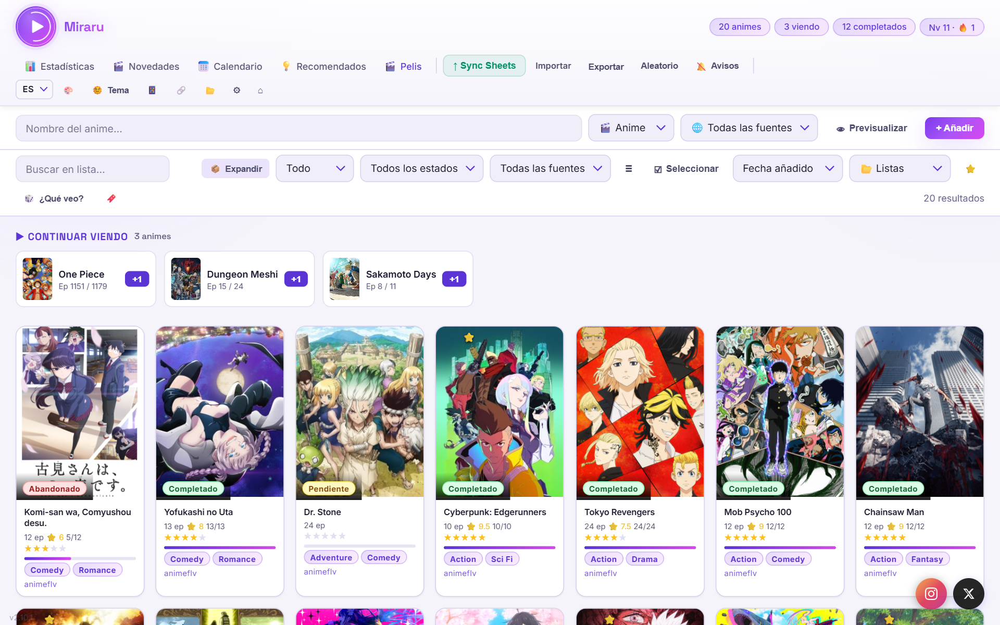
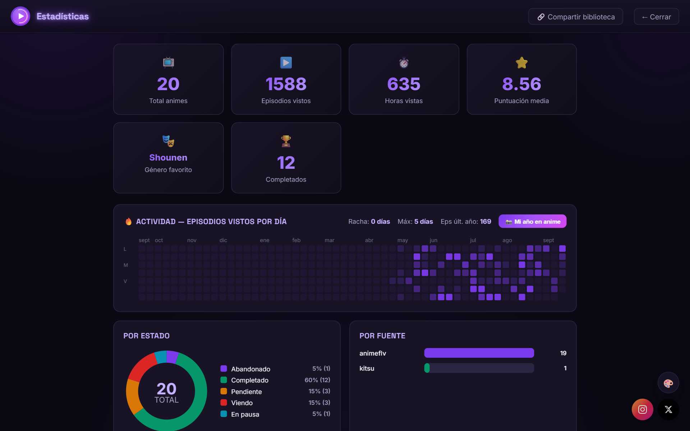

# Miraru

[](https://github.com/lucasusamentiaga/anime-tracker/actions/workflows/ci.yml)
[](https://github.com/lucasusamentiaga/anime-tracker/releases/latest)


**Tu biblioteca personal de anime, manga, series y películas.** App de escritorio para Windows
que funciona en tu navegador: lleva la cuenta de los episodios que ves, te avisa cuando sale uno
nuevo, te recomienda qué ver y te enseña tus estadísticas. Todo se guarda en tu PC, sin cuentas
ni nube.

**[⬇ Descargar la última versión](https://github.com/lucasusamentiaga/anime-tracker/releases/latest)**

## 📸 Capturas

| Biblioteca (oscuro) | Biblioteca (claro) |
|---|---|
|  |  |

| Estadísticas | Calendario semanal |
|---|---|
|  |  |

## ✨ Qué puedes hacer

**Tu biblioteca**
- Añade anime escribiendo el nombre (con autocompletado) o pegando un enlace de AniList o MyAnimeList
- Busca en AniList, MyAnimeList (Jikan), Kitsu, AnimeFLV, AnimeAV1, Anime-Planet o Crunchyroll, o en todas a la vez
- Estados (pendiente, viendo, completado, en pausa, abandonado), puntuación, favoritos, listas propias y notas
- **+1 episodio** con un clic, notas por episodio y **deshacer** al borrar
- Temporadas de una misma serie agrupadas en franquicias
- **Manga**: seguimiento por volúmenes
- **Películas y series** (no anime) con datos de TMDB
- Vista en tarjetas o tabla, selección múltiple, arrastrar a listas y búsqueda con filtros (`genre:`, `score:`, `eps:`, `year:`, `fav:`…)
- **Paleta de comandos** (`Ctrl+K`) y atajos: `/` buscar, `N` añadir, `?` ver todos

**Descubrir y no perderte nada**
- **Calendario semanal** de lo que estás viendo y **avisos de nuevos episodios**: en el navegador, por email o como notificación del sistema aunque cierres la pestaña
- **¿Qué veo esta noche?**: te sugiere algo según tu ánimo y el tiempo que tengas
- **Recomendaciones** según tus géneros favoritos y una selección para empezar en el anime
- **Novedades**: estrenos por plataforma (Crunchyroll, Netflix, Amazon, Disney+) y noticias
- En cada ficha: tráiler, dónde verlo, openings, personajes, títulos similares y puntuaciones de AniList, MAL y Kitsu

**Tus números**
- Estadísticas con horas vistas, géneros, heatmap de actividad y tiempo hasta completar
- Niveles, rachas y logros
- "Mi año en anime" como imagen para compartir y página HTML con tu biblioteca

**Más**
- **Sincronización con AniList** en los dos sentidos
- **Carpeta vigilada**: marca como visto el episodio que acabas de descargar
- Sincronización con Google Sheets (opcional)
- Acceso desde el **móvil** por la WiFi de casa, con PIN (instalable como app)
- Funciona sin conexión con lo que ya tienes guardado
- 4 idiomas (español, inglés, francés, alemán), modo claro y oscuro y colores personalizables
- Importa desde MyAnimeList (XML), AniList o pegando el texto de cualquier web; exporta a CSV y JSON; copias de seguridad automáticas

## 📥 Instalación

### Recomendada: un comando (Windows 10 y 11)

1. Abre **PowerShell**: pulsa `Win`, escribe *PowerShell* y pulsa Intro.
2. Pega esta línea y pulsa Intro:

```powershell
irm https://raw.githubusercontent.com/lucasusamentiaga/anime-tracker/main/install.ps1 | iex
```

En un par de minutos Miraru se abre en tu navegador y queda en el menú Inicio y en el
escritorio. No pide permisos de administrador y **funciona aunque Windows tenga activado el
Control inteligente de aplicaciones**, porque no usa ningún `.exe` sin firma: instala Python
oficial de [python.org](https://www.python.org) (si no lo tienes) y el código de Miraru en
`%LOCALAPPDATA%\Miraru`.

- **Actualizar**: vuelve a ejecutar el mismo comando. Tu lista y tu configuración se conservan.
- **Desinstalar**: *Configuración → Aplicaciones → Miraru → Desinstalar* (borra también tus datos).
- Si antes usabas el instalador `.exe`, la primera vez se trae tu lista automáticamente.

### Alternativa: descargar un `.exe`

Desde la [última versión](https://github.com/lucasusamentiaga/anime-tracker/releases/latest):
**`Miraru-Portable.exe`** (doble clic y listo; guarda tus datos junto al `.exe`) o
**`Miraru-Setup.exe`** (instalador con accesos directos).

> Los `.exe` aún no tienen firma digital:
> - Windows puede avisar de *"editor desconocido"*: pulsa **Más información → Ejecutar de todas formas**.
> - Con el *Control inteligente de aplicaciones* activado (o en equipos de empresa o centro
>   educativo) Windows **no deja abrirlos** (*"Una directiva de Control de aplicaciones bloqueó
>   este archivo"*). En ese caso usa la instalación con un comando.

**Para cerrar Miraru**, usa el botón **⏻ Salir** del menú: cerrar la pestaña no apaga la app.

## 📱 Móvil

1. En el PC abre **📱 Acceso móvil**, elige un PIN y pulsa **Activar**.
2. Cierra Miraru y vuelve a abrirlo.
3. En el móvil, conectado a la misma WiFi, abre la dirección que te muestra esa pantalla
   (`http://IP-de-tu-PC:8765/app`), introduce el PIN y usa **Añadir a pantalla de inicio**.

Úsalo solo en redes de confianza, como la de tu casa.

## 🚀 Ejecutar desde el código

Requiere **Python 3.10 o superior** ([python.org](https://www.python.org/downloads/)).

En Windows, haz **doble clic en `Miraru.vbs`**. Busca Python, instala lo que falte la primera
vez y abre el navegador, sin ventanas de consola. Si algo falla, lo explica en un cuadro de
diálogo y guarda el detalle en `arranque.log`.

<details>
<summary>A mano (cualquier sistema)</summary>

```bash
git clone https://github.com/lucasusamentiaga/anime-tracker.git
cd anime-tracker
pip install -r requirements.txt
python launcher.py        # arranca y abre el navegador
# o solo el servidor:     python main.py  →  http://127.0.0.1:8765
```
</details>

<details>
<summary>Desarrollo: tests y ejecutables</summary>

```bash
pip install -r requirements-dev.txt
python -m pytest tests/ -q
ruff check .
```

Para publicar una versión basta con subir un tag (`git tag -a vX.Y.Z -m vX.Y.Z && git push origin vX.Y.Z`):
GitHub Actions compila `Miraru-Setup.exe` y `Miraru-Portable.exe` y los adjunta a la Release
(`.github/workflows/release.yml`). En local: `python build.py` (instalador) o
`python build.py --portable`. Para publicar en Scoop o winget, ver [`packaging/README.md`](packaging/README.md).
</details>

## 🔏 Política de firma de código / Code signing policy

> **Estado:** solicitud a SignPath Foundation en trámite. Hasta que se apruebe, los `.exe`
> se publican **sin firma**; la [instalación con un comando](#-instalación) no los necesita.

Free code signing provided by [SignPath.io](https://about.signpath.io), certificate by [SignPath Foundation](https://signpath.org)

- **Autores y revisores (committers and reviewers):** [@lucasusamentiaga](https://github.com/lucasusamentiaga)
- **Aprobadores (approvers):** [@lucasusamentiaga](https://github.com/lucasusamentiaga)
- Solo se firman los binarios de Miraru (`Miraru-Setup.exe`, `Miraru-Portable.exe` y el `AnimeTracker.exe` que va dentro del instalador), compilados automáticamente por GitHub Actions desde este repositorio público ([`release.yml`](.github/workflows/release.yml)). Cada firma la aprueba a mano un aprobador.

**Privacidad / Privacy:** This program will not transfer any information to other networked systems unless specifically requested by the user or the person installing or operating it.
Miraru guarda tu lista en tu propio equipo. Solo se conecta a servicios externos para lo que tú usas: buscar datos de anime (AniList, MyAnimeList, Kitsu…), películas (TMDB), comprobar si hay una versión nueva en GitHub, y los avisos, AniList o Google Sheets si los activas. No hay analíticas ni telemetría.

## 📦 Tecnologías

- **Backend**: Python 3.10+, FastAPI, SQLite
- **Frontend**: HTML, CSS y JavaScript sin frameworks, Service Worker (sin conexión y notificaciones)
- **Datos**: AniList (GraphQL), Jikan v4 (MyAnimeList), Kitsu, TMDB, AnimeThemes
- **Empaquetado**: PyInstaller

## 📄 Licencia

[MIT](LICENSE) — [@T0ff3_x](https://x.com/T0ff3_x)

---

*Hecho con 🎌 y mucho café*
